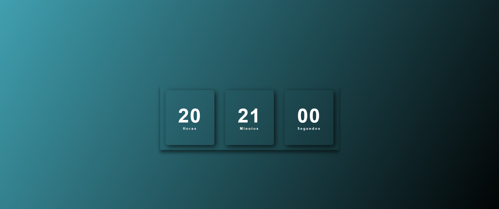

<h1 align="center"> Relógio Digital </h1>

Relógio feito com HTML, CSS e JavaScript.  

  <a href="#-tecnologias">Tecnologias</a>&nbsp;&nbsp;&nbsp;|&nbsp;&nbsp;&nbsp;
  <a href="#-projeto">Projeto</a>

 

  

## 🚀 Tecnologias

Esse projeto foi desenvolvido com as seguintes tecnologias:

- HTML e CSS
- JavaScript
- Git e Github

## 💻 Projeto

Este projeto consiste em um relógio digital simples e elegante, desenvolvido utilizando HTML, CSS e JavaScript. Ele exibe a hora atual em formato digital (horas, minutos e segundos) e atualiza automaticamente a cada segundo. O relógio foi estilizado para oferecer uma interface visual agradável e moderna.
- [Acesse o projeto finalizado, online](https://luishmonteiro.github.io/RelogioDigital)